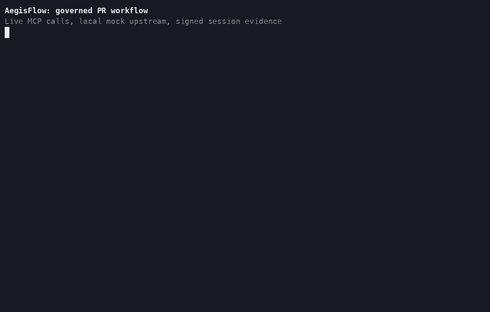

# AegisFlow

AegisFlow is a local-first policy gateway for coding agents. Allow, review, or block MCP, shell, SQL, GitHub, and HTTP actions, issue scoped credentials, and verify tamper-evident evidence.

[](https://github.com/saivedant169/AegisFlow/actions/workflows/ci.yaml)
[](https://github.com/saivedant169/AegisFlow/actions/workflows/codeql.yml)
[](https://scorecard.dev/viewer/?uri=github.com/saivedant169/AegisFlow)
[](https://goreportcard.com/report/github.com/saivedant169/AegisFlow)
[](https://pkg.go.dev/github.com/saivedant169/AegisFlow)
[](https://github.com/saivedant169/AegisFlow/releases/latest)
[](https://hub.docker.com/r/saivedant169/aegisflow)
[](LICENSE)

<p align="center">
  
</p>

## Start here

Run a governed PR-writer policy locally. No provider key or paid service required.

```bash
git clone https://github.com/saivedant169/AegisFlow.git
cd AegisFlow/starter-kit
./install-pr-writer.sh
```

Installer builds AegisFlow, starts local gateway and admin services, loads PR-writer policy, and checks allow, review, and block decisions.

Connect an agent after checks pass:

- [Claude Code setup](starter-kit/editors/claude-code.md)
- [Cursor setup](starter-kit/editors/cursor.md)
- [PR-writer quickstart](starter-kit/QUICKSTART_PR_WRITER.md)
- [Full proof walkthrough](docs/PR_WRITER.md)

## What gets enforced

Every action routed through AegisFlow becomes an `ActionEnvelope`. Policy evaluates protocol, tool, target, capability, actor, task, and session context.

| Routed action | Example | Default PR-writer decision |
|---|---|---|
| Read repository content | `github.get_file_contents` | allow |
| Run tests | `shell.go_test` | allow |
| Delete files recursively | `shell.rm` | block |
| Open a pull request | `github.create_pull_request` | review |
| Merge or force push | `github.merge_pull_request` | block |
| Read database rows | `sql.select` | allow with `sql-explorer` |
| Change database rows | `sql.update` | review with `sql-explorer` |

Review decisions enter an approval queue. Approved actions receive task-specific credentials where a broker supports them. Every decision and approval enters signed session evidence.

```text
Agent or client
      |
      v
MCP, OpenAI-compatible, or Messages API
      |
      v
ActionEnvelope -> policy -> allow | review | block
                         |             |
                         v             v
                 scoped credential   evidence chain
                         |
                         v
                  external tool
```

## Boundary support

| Path | Governed behavior | Status |
|---|---|---|
| MCP remote gateway | `tools/list`, tool calls, arguments, review resume | supported |
| MCP stdio bridge | Routed tool calls and gateway failures | supported |
| OpenAI-compatible API | Input, output, streams, tool definitions, tool calls | supported |
| Anthropic Messages API | Input, output, streams, optional tool passthrough | supported |
| Built-in editor file or shell tools | Only covered when routed through MCP or another configured boundary | not intercepted directly |
| Standalone shell, SQL, GitHub, and HTTP gate libraries | Library behavior and unit tests | experimental, not wired |

`messages_api.tool_passthrough` remains off by default. Enable it only after testing selected provider tool loops.

## Install

### Verified release binary

```bash
curl -fsSL https://raw.githubusercontent.com/saivedant169/AegisFlow/v0.9.0/scripts/install.sh | sh
```

Installer downloads `SHA256SUMS` from same release and rejects mismatched binaries.

### Homebrew

```bash
brew install saivedant169/tap/aegisflow
brew install saivedant169/tap/aegisctl
```

### Go

```bash
go install github.com/saivedant169/AegisFlow/cmd/aegisflow@v0.9.0
go install github.com/saivedant169/AegisFlow/cmd/aegisctl@v0.9.0
```

Source builds require Go 1.26.6 or later.

### Container

```bash
docker run --rm -p 8080:8080 -p 8081:8081 -p 8082:8082 \
  saivedant169/aegisflow:0.9.0
```

Same image also publishes at `ghcr.io/saivedant169/aegisflow:0.9.0`.

### Docker Compose

```bash
git clone https://github.com/saivedant169/AegisFlow.git
cd AegisFlow
docker compose -f deployments/docker-compose.yaml up --build
```

Gateway listens on `8080`, admin API and dashboard on `8081`, MCP gateway on `8082`.

## Policy packs

| Pack | Intended use | Read | Risky write | Destructive action |
|---|---|---:|---:|---:|
| `readonly` | Inspection and analysis | allow | block | block |
| `pr-writer` | Read, test, edit, open PR | allow | review | block |
| `docs-writer` | Documentation changes | allow | review | block |
| `infra-review` | Infrastructure planning | allow | review | block |
| `sql-explorer` | Data exploration | allow | review | block |

Policy files and tuning notes live under [`starter-kit/policies`](starter-kit/policies).

## Evidence and approvals

```bash
# Check gateway, admin API, providers, approvals, and evidence state
./bin/aegisctl status

# List pending actions
./bin/aegisctl pending

# Approve one exact action
./bin/aegisctl approve <action-id> "reviewed diff"

# Export and verify a session
./bin/aegisctl evidence export <session-id> --file evidence.json
./bin/aegisctl verify
```

Set `AEGISFLOW_EVIDENCE_KEY` to a stable secret when evidence must verify across restarts. Without it, AegisFlow creates an ephemeral key and logs a warning.

## Release verification

v0.9.0 release includes checksums, Sigstore bundle, SPDX SBOM, and GitHub build provenance.

```bash
asset=aegisflow-linux-amd64
grep "  ${asset}$" SHA256SUMS | sha256sum --check -
cosign verify-blob \
  --bundle SHA256SUMS.sigstore.json \
  --certificate-identity-regexp '^https://github\.com/saivedant169/AegisFlow/\.github/workflows/release\.yaml@refs/tags/v0\.9\.0$' \
  --certificate-oidc-issuer https://token.actions.githubusercontent.com \
  SHA256SUMS
gh attestation verify aegisflow-linux-amd64 \
  --repo saivedant169/AegisFlow
```

See [v0.9.0 release notes](docs/releases/v0.9.0.md) for upgrade steps and known limits.

## Documentation

| Need | Document |
|---|---|
| First local request | [Getting started](docs/getting-started.md) |
| Governed PR example | [PR-writer proof](docs/PR_WRITER.md) |
| Runtime components | [Architecture](docs/architecture.md) |
| API endpoints | [OpenAPI specification](api/openapi.yaml) |
| Configuration | [Annotated config](configs/aegisflow.example.yaml) |
| Deployment checks | [Production checklist](docs/production-checklist.md) |
| Incident response | [Operations runbook](docs/operations-runbook.md) |
| Metrics and traces | [Observability](docs/observability.md) |
| Performance method | [Performance](docs/performance.md) |
| Threat boundary | [Threat model](docs/security/THREAT_MODEL.md) |
| Provider and policy problems | [Troubleshooting](docs/troubleshooting.md) |

## Development

```bash
make build
make test
make vuln
make smoke
```

Current CI runs formatting, build, race tests, vulnerability checks, installer verification, Docker smoke tests, CodeQL, and OpenSSF Scorecard.

Contribution rules: [CONTRIBUTING.md](CONTRIBUTING.md). Security reports: [SECURITY.md](SECURITY.md). Questions and policy examples belong in [GitHub Discussions](https://github.com/saivedant169/AegisFlow/discussions).

## License

Apache License 2.0. See [LICENSE](LICENSE).
