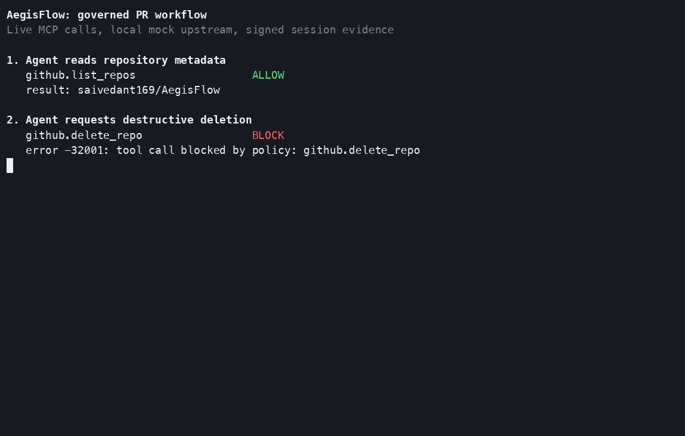
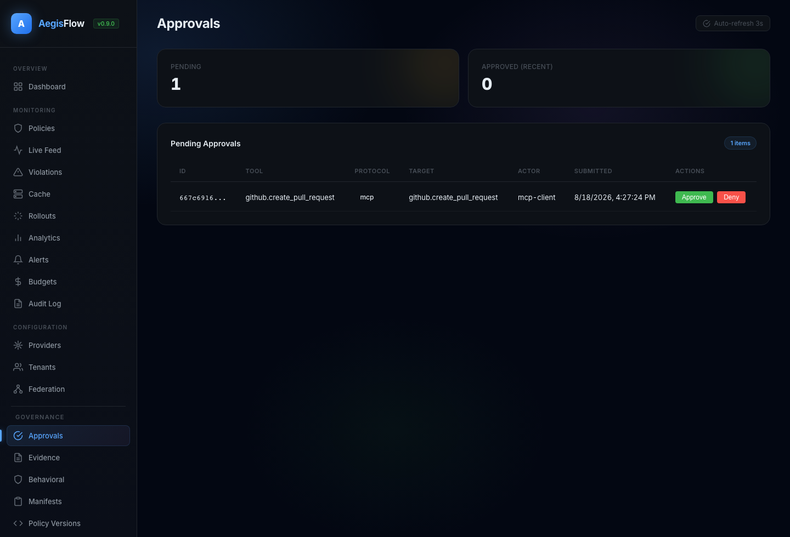
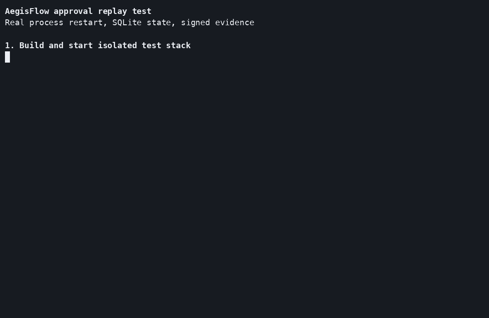
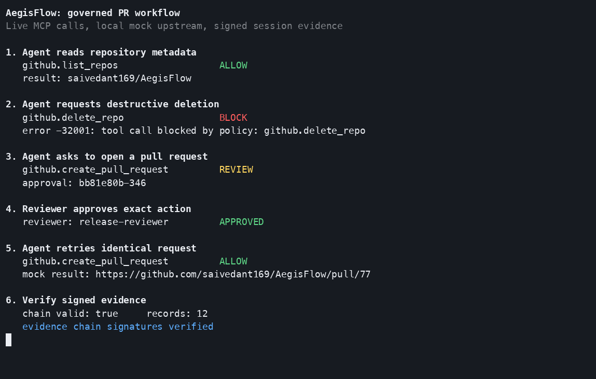

# Governed pull request proof

This walkthrough runs real AegisFlow MCP and admin endpoints against local mock GitHub server. No provider key, GitHub token, or paid service is used.

Recorded flow:


## What proof covers

| Step | Routed action | Decision or result |
|---|---|---|
| 1 | `github.list_repos` | allow, then forward upstream |
| 2 | `github.delete_repo` | block with JSON-RPC `-32001` |
| 3 | `github.create_pull_request` | review with JSON-RPC `-32002` |
| 4 | Reviewer approves pending item | approved |
| 5 | Client retries same pull request | allow, then forward upstream |
| 6 | Session evidence verification | valid signatures and chain |

Approval applies to one exact action. Request ID and timestamp may change during retry. Actor, task, protocol, tool, target, arguments, and requested capability must match.

## Run starter kit

Prerequisites: Go 1.26.6 or later, Node.js, `curl`, and `jq`.

```bash
git clone https://github.com/saivedant169/AegisFlow.git
cd AegisFlow/starter-kit
./install-pr-writer.sh
```

Installer performs these checks:

- Builds `aegisflow` and `aegisctl`.
- Starts gateway, admin API, MCP gateway, and mock MCP upstream.
- Confirms one allow, one review, and one block policy decision.

Local endpoints:

| Service | Address |
|---|---|
| Gateway | `http://127.0.0.1:8080` |
| Admin dashboard and API | `http://127.0.0.1:8081` |
| MCP gateway | `http://127.0.0.1:8082/mcp` |
| Mock MCP upstream | `http://127.0.0.1:3000` |

Generated local config is `configs/pr-writer.yaml`. Policy source is [`starter-kit/policies/pr-writer.yaml`](https://github.com/saivedant169/AegisFlow/blob/main/starter-kit/policies/pr-writer.yaml).

## Reproduce recorded proof

Run from repository root after starter kit is active:

```bash
./scripts/record-proof.sh
```

Script sends JSON-RPC calls through MCP gateway. It reads approval from admin queue, approves exact action through admin API, retries call, then verifies default evidence session.

Expected decision lines:

```text
github.list_repos                  ALLOW
github.delete_repo                 BLOCK
github.create_pull_request         REVIEW
reviewer: release-reviewer         APPROVED
github.create_pull_request         ALLOW
chain valid: true
evidence chain signatures verified
```

## Blocked action

Blocked call never reaches upstream mock server. MCP client receives structured error.



Relevant policy rule:

```yaml
- protocol: "mcp"
  tool: "github.delete_*"
  decision: "block"
```

## Approval queue

Pull request creation waits in admin queue. Reviewer can inspect tool, target, actor, and submission time before choosing approve or deny.



CLI can handle same queue:

```bash
./bin/aegisctl pending
./bin/aegisctl approve <approval-id> "diff scope checked"
```

Approval is consumed after matching retry. Changed title, branch, base, repository, actor, or task creates new review.

Restart and replay test uses same HTTP path and records each assertion:



```bash
make e2e-approval-security
```

## Signed evidence

Set stable evidence key before gateway starts:

```bash
export AEGISFLOW_EVIDENCE_KEY=<secret-from-key-manager>
```

Starter installer enables SQLite state under `.aegisflow-run/state.db` and keeps local evidence key in `.aegisflow-run/evidence.key`. For production, load key from secret manager. Without SQLite, approval and evidence state stays in memory.

```bash
./bin/aegisctl evidence sessions
./bin/aegisctl verify --session <session-id>
./bin/aegisctl evidence export <session-id> --file evidence.json
```



Hash chain detects edits, deletions, and reordered records. It does not prove calls outside AegisFlow never happened.

## Scoped credentials

GitHub App and AWS STS brokers can issue task-specific credentials after policy and approval checks. Local proof uses mock upstream, so it does not mint real credential.

Before enabling broker:

1. Configure installation or role with narrow base permissions.
2. Store private key or cloud credential outside repository.
3. Confirm requested repository, action, and expiry in evidence.
4. Test denial and expiry before production use.

## Connect editor

- [Claude Code setup](https://github.com/saivedant169/AegisFlow/blob/main/starter-kit/editors/claude-code.md)
- [Cursor setup](https://github.com/saivedant169/AegisFlow/blob/main/starter-kit/editors/cursor.md)

Editor built-in file and shell actions are not intercepted automatically. Only calls routed through AegisFlow boundary enter policy engine.

## Stop local services

Installer writes process IDs under `.aegisflow-run/`:

```bash
kill "$(cat .aegisflow-run/aegisflow.pid)"
kill "$(cat .aegisflow-run/mock-mcp.pid)"
```

Read [threat model](security/THREAT_MODEL.md) before production use. Use [troubleshooting guide](troubleshooting.md) when local checks fail.
